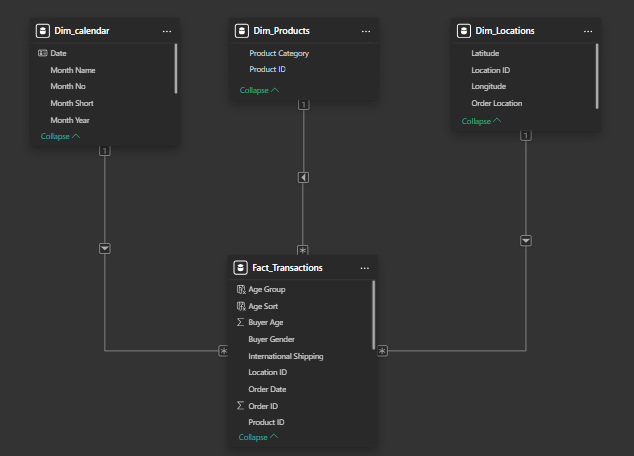
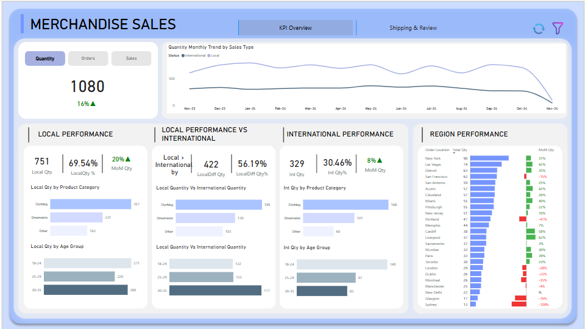
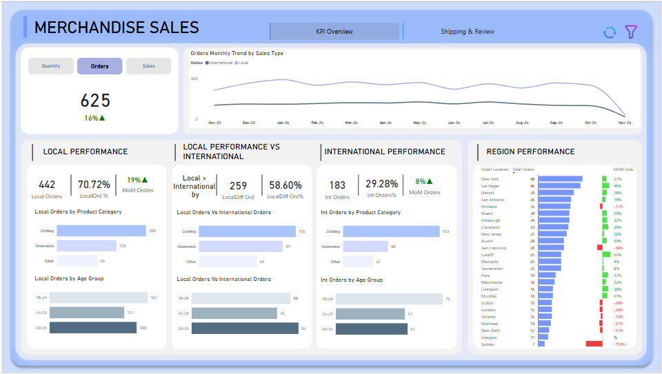
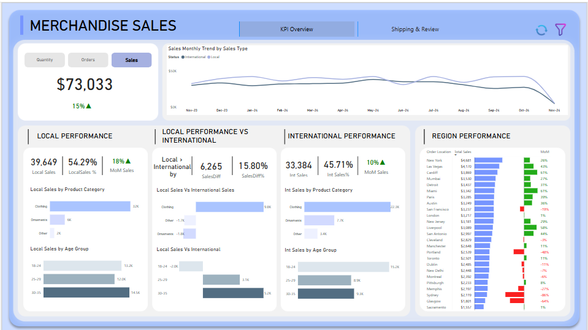
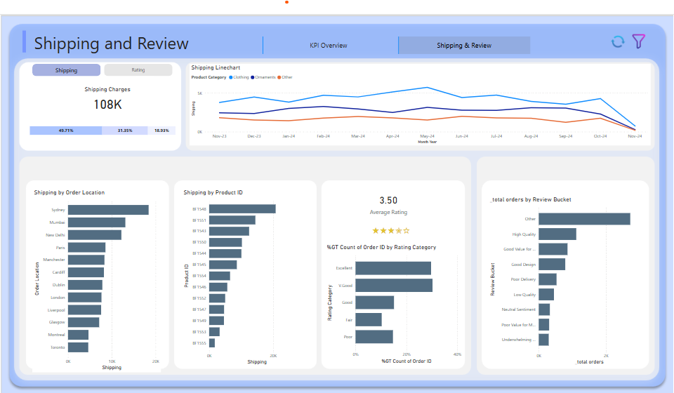
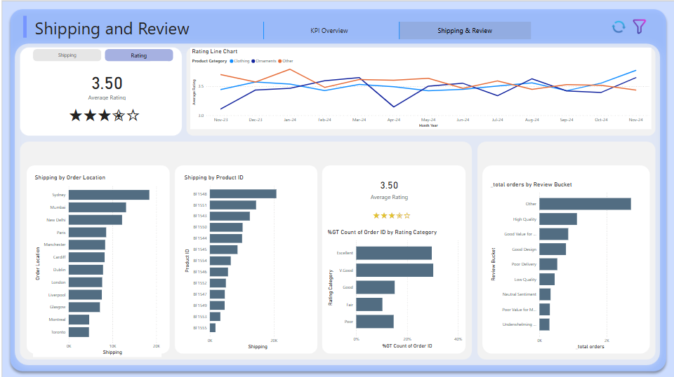

# Merchandise Sales Analysis
## Introduction
Lee Chatmen is a popular influencer from the United States with over 7 million TikTok followers. He became famous for his entertaining videos, where he plays popular songs on miniature guitars. In 2023, Lee launched his own line of merchandise. This analysis looks at how his merchandise sales are going and what we can learn from the data.

These questions guided the analysis:
- What are the overall sales trends?
- Which product categories perform the best?
- What are the most and least popular products?
- How does location affect sales performance?
- What impact does international shipping have on sales?
- What is the demographic profile of buyers?
- How do ratings and reviews correlate with sales?

## Key Deliverables
`Customer Persona Profiles:`
- Detailed profiles of target customers based on demographic data, location, and spending patterns.
  
`Low-Performing Region Insights:`
- A clear action plan to penetrate low-performing regions with tailored marketing strategies.
  
`Rating and Review Dashboard:`
- Visualizations of rating trends and actionable insights from review sentiment analysis.
  
`Cost Analysis Report:`
- Recommendations for reducing shipping and operational costs while maintaining service quality.

## Exploratory Data Analysis
The following scenario analysis were adopted;
1. Identifying Target Customers
  - Demographic Segmentation:
    - Analyze buyer demographics (Gender and Age) to identify the largest customer base.
    - Determine the age group and gender that contribute most to total sales.
    - Product preferences: Explore which product categories (Clothing, Ornaments, Others) are most popular among specific demographics.
  - High-Value Locations:
    - Identify order locations with the highest sales volume and total sales.
    - Analyze buyer demographics within these high-performing regions to uncover customer profiles.
  - Spending Behavior:
    - Evaluate the average sales per unit and quantity purchased across demographics and regions to identify high-spending customers.
2. Improving Ratings and Identifying Issues with Poor Ratings
  - Ratings Distribution:
    - Analyze the average ratings by product category, location, and demographic to identify trends in poor ratings.
    - Filter orders with ratings below a threshold (e.g., <3) to explore potential issues.
  - Review Analysis:
    - Perform sentiment analysis on Review data to identify common complaints or pain points (e.g., shipping delays, product quality, high prices).
  - Product and Region Insights:
    - Highlight products or regions frequently associated with poor ratings.
    - Compare ratings for domestic vs. international orders to check if shipping impacts customer satisfaction.

## Extraction, Transformation and Loading of Data
The datasets were sourced from an `Excel file`, and several key data transformation steps were performed using the Power Query Editor to ensure the data was clean, accurate, and ready for analysis.

The transformation process began with data cleaning to enhance data quality. This involved removing null values and eliminating empty spaces within data rows, ensuring consistency and completeness across the dataset. By addressing these inconsistencies, the data was optimized for analysis, reducing the risk of errors or inaccurate insights.

## Skills/concepts demonstrated:
The following Power Bi features were incorporated
-  Bookmarking and Filtering
-  DAX and Quick measures
-  Page Navigation
## The Logic
- Creating Age bracket into 18-24 (Gen Z), 25-29 (early career professional or millennials), 30-35 (matured buyers)
- A KPI visual is used to measure MoM and MoM percentage on Sales, Orders and Quantities of product
- Measures on Local Performance and International performance on Sales, Orders and Quantities of product
- Measures of shipping and reviews of product

### Data Model
 

### MoM Sales
 ~~~ DAX
MoM Sales = 
VAR Sales = [_total sales]
VAR PrevMonth = 
    CALCULATE([_total sales],
                DATEADD(Dim_calendar[Date],-1,MONTH)
    )
VAR Diff = Sales - PrevMonth
VAR DiffPer = DIVIDE(Diff,Sales,0)
RETURN
    IF(DiffPer > 0, FORMAT(DiffPer, "#%") & "▲",
        FORMAT(DiffPer, "#%") & "▼")
~~~
### Rating
 ~~~ DAX
Rating Fill = 
VAR Rating = AVERAGE(Fact_Transactions[Rating%])
VAR NoIcon = 5
VAR NFillIcon = INT(Rating * NoIcon) // Full stars
VAR FractionalPart = MOD(Rating * NoIcon, 1) // Fractional part of the rating
VAR HasHalfStar = IF(FractionalPart > 0.49, 1, 0) // Check if there's a half star
VAR NEmptyIcon = NoIcon - NFillIcon - HasHalfStar // Remaining empty stars
VAR FillIcon = "★"
VAR HalfIcon = "✬" // Half-filled star (replace with a suitable character if needed)
VAR EmptyIcon = "☆"
VAR Bars = 
    REPT(FillIcon, NFillIcon) & 
    REPT(HalfIcon, HasHalfStar) & 
    REPT(EmptyIcon, NEmptyIcon)
RETURN
Bars
~~~
    
## Visualization
The report comprises of 2 major pages:
- KPI overview
- Shipping and Reviews
  
You can interact with the report [here](https://app.powerbi.com/view?r=eyJrIjoiMzlhYmRjMDEtYmIzMi00MTEwLWJlNzktZmUyYWYwOTc4NTZlIiwidCI6ImYzMzNmMDE4LWE3OTYtNGQ5Yy1iNmM4LThmY2RmYzAyNzEwYiJ9)

### KPI Overview
The page comprises of reports on Quantity, orders and Sales

 ### Report on Quantity
 
 This report shows the local and international quantity of product sold, the different between the quantity sold, the regional Quantity sold and different product category of quantity sold. 

 
### Findings

🧾 Summary: Sales by Quantity
- Total Quantity Sold: 1,080 units
- MoM (Month-over-Month) Growth: 16% ↑ — positive sign of increasing volume.

📈 Monthly Trend (Nov 2023 – Nov 2024)
- Shows a steady trend across months with noticeable dips in November 2024, similar to the sales value chart.
- Local sales consistently higher in quantity than international throughout the year.

🏠 Local Performance
- Local Quantity Sold: 751 units (69.54%)
- MoM Growth: 20% ↑ — outpacing international growth again.
- By Product Category:
  - Clothing: ~375 units — dominant category
  - Ornaments: ~231
  - Other: ~145
- By Age Group:
  - 25–30 and 30–45 are the top consumer groups (~260 & ~200 units respectively)
  - 18–24 also performs well (~221 units)

🌍 International Performance
- Quantity Sold: 329 units (30.46%)
- MoM Growth: 8% ↑
- By Product Category:
  - Clothing: 168 unit
  - Ornaments: 101
  - Other: 60
- By Age Group:
  - Top groups: 30–45 and 25–30
  - Slightly more balanced distribution than local sales

🔄 Local vs International
- Local sold 422 more units than International → 56.19% difference
- Clothing has the widest performance gap (245 local vs 168 int)
- Age groups follow similar patterns, but local is stronger across all segments

🌎 Region Performance
- Top Quantity Performers:
  - New York, Las Vegas, Detroit, San Francisco
  - All saw positive MoM growth (30–45%+)
- Bottom Performers:
  - Sacramento, Chicago, Sydney
  - Saw negative MoM growth, with Sydney having a sharp -90%

📊 Key Insights & Takeaways

✅ Strengths:
- Positive overall growth in quantity sold (16% MoM)
- Local market is strong — both in value and volume
- Clothing continues to be the best-performing category
- Age 25–45 drives the majority of purchases, a reliable core segment
- Several key cities (NY, Vegas, Detroit) are growing fast

⚠️ Challenges:
- International sales lag in both value and volume
- Sydney and Sacramento need attention — sharp drops could hint at delivery, inventory, or demand issues
- November dip appears in both visuals — could be seasonal or operational

💡 Recommendations:

- 🎯 Double down on local campaigns — they’re working! Expand into similar domestic regions.
- 🌐 International strategy revamp — explore new markets or optimize shipping/logistics.
- 👕 Expand clothing line — it’s the top seller; consider bundling or discounts to drive even more volume.
- 🧓 Engage older and younger age groups more with targeted promotions.
- 📍 Investigate underperforming regions for root causes — stockouts? Ads not reaching audience?

### Report on Orders

 This report shows the local and international quantity of product ordered, the different between the quantity ordered, the regional Quantity sold and different product category of quantity ordered

### Findings

🧾 Summary: Sales by Orders
- Total Orders: 625
- MoM Growth: 16% ↑ — healthy order growth aligns with trends in both sales value and quantity.

📈 Monthly Trend: Nov 2023 – Nov 2024
- The order trend shows gradual growth with small fluctuations, followed by a noticeable dip in November 2024 (just like in Sales & Quantity).
- Local orders consistently outperform international across all months.

🏠 Local Performance
- Local Orders: 442 (70.72%)
- MoM Growth: 19% ↑
- By Product Category:
  - Clothing dominates again: 208 orders
  - Ornaments: 139
  - Other: 95
- By Age Group:
  - 25–30 age group leads (~176 orders)
  - 30–45: 160 orders
  - 18–24: 106 orders

🌍 International Performance
- Orders: 183 (29.28%)
- MoM Growth: 8% ↑
- By Product Category:
  - Clothing: 103 orders
  - Ornaments: 48
  - Other: 32
- By Age Group:
  - 30–45 and 25–30 continue to lead
  - 18–24 lags slightly behind

🔄 Local vs International
- Local had 259 more orders than international — a 58.60% difference
- Every product category and age group shows stronger order counts in the local market
- Clothing again shows the widest margin

🌎 Region Performance
- Top Cities by Orders:
  - New York (48), Las Vegas (41), Detroit (38), Boston (36)
  - All top performers show positive MoM growth, suggesting regional campaigns may be working
- Cities with Order Declines:
  - Sydney (-114%), Chicago, Dallas, Miami — sharp MoM drops that need investigation
- There’s a clear split in order performance between high-growth regions and those in decline.

📊 Insights & Takeaways

✅ Positives:
- Consistent growth across all KPIs (Sales, Quantity, Orders)
- Clothing remains the most popular product by a large margin
- Local performance dominates with nearly 3x the orders vs international
- 25–45 age group is the most engaged demographic across all metrics
- Several US cities are thriving (NYC, Vegas, Detroit)

⚠️ Challenges:
- International orders are low and only growing modestly
- Decline in November 2024 across all KPIs (Sales, Quantity, Orders) — indicates potential issue or seasonal trend
- Underperforming regions need immediate attention — possibly revisit marketing, logistics, or customer service

💡 Strategic Recommendations
- Target International Expansion.
Local orders are very strong, but international is under-leveraged. Tailored regional campaigns, currency localization, and shipping incentives could help.
- Promote Mid-tier Age Groups.
25–45 is your golden demographic. Double down with loyalty programs or targeted email campaigns.
- Optimize Product Mix
Clothing leads. Consider bundling with ornaments or pushing seasonal offers to lift "Other" category performance.
- Investigate Regional Declines.
Cities like Sydney and Chicago show major drops. Analyze product availability, delivery delays, or competition in those regions.
- Plan for Nov 2024 Dip
As this trend is visible across all metrics, pre-empt with promotions or clearance sales to stimulate demand.

### Report on Sales

This report shows the local and international sales, the different between the sales, the regional sales and different product category sales 

### Findings
- Key Matric
    - Total Sales of $73,033
    - MoM Growth: 15% ↑ — a positive growth trend.
- Sales Monthly Trend (Nov 2023 – Nov 2024)
    - Sales Types: Local vs International
    - The trend is relatively stable with slight fluctuations. There's a decline in November 2024

🏠 Local Performance
- Sales: $39,649 (54.29% of total)
- MoM Growth: 18% ↑ — higher than international, showing strong domestic demand.
- By Product Category:
    - Clothing dominates with ~25K
    - Ornaments: ~6K
    - Other: ~3K
- By Age Group:
    - 30–45 age group has the highest purchases (~15K)
    - Followed by 18–29 and 45–60
  
🌍 International Performance
- Sales: $33,384 (45.71% of total)
- MoM Growth: 10% ↑ — still positive but behind local.
- By Product Category:
    - Clothing again leads (~22.5K)
    - Ornaments (~7.7K) are more popular internationally compared to local.
- By Age Group:
    - 30–45 is again dominant (~13.5K)
    - More balanced spread across age groups compared to local.
      
⚖️ Local vs International Comparison
- Local outperformed International by:
    - 6,265 in sales
    - 15.8% sales difference
- Local had stronger sales in clothing, but international led in ornaments and had stronger balance across categories.

🌎 Region Performance
- Top Performing Regions:
  - New York ($4,601), Las Vegas, and Miami with strong MoM growth (~40%+)
- Poor Performing Regions:
  - Dallas, Chicago, Sacramento saw sharp declines (up to -80%)
- There's a clear variance in regional performance, suggesting a need for localized marketing or inventory adjustments.

🔍 Insights & Recommendations

✅ What’s Going Well:
- Overall Sales Growth: Positive trend (15% MoM)
- Local Sales: Outperforming international both in volume and growth
- Clothing Category: Driving the bulk of sales across all regions and age groups
- Age Group 30–45: A key target segment — high conversion in both markets

⚠️ What Needs Attention:
- Drop in Nov 2024: Analyze potential causes 
- Underperforming Regions: Focus on Dallas, Chicago, Sacramento — consider targeted promotions
- Product Category Gap: “Other” categories show weak performance — reevaluate offerings or visibility

💡 Opportunities:
- Boost International Growth: Local campaigns seem effective — apply similar tactics abroad
- Age Segmentation: 18–29 and 45–60 groups show promise, especially internationally
- Ornaments Category: Perform better internationally — promote locally too
   

Report on Shipping

Report on Rating

